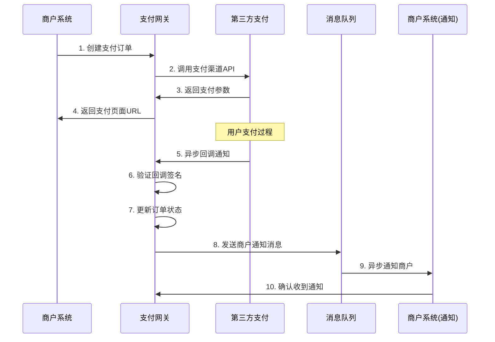
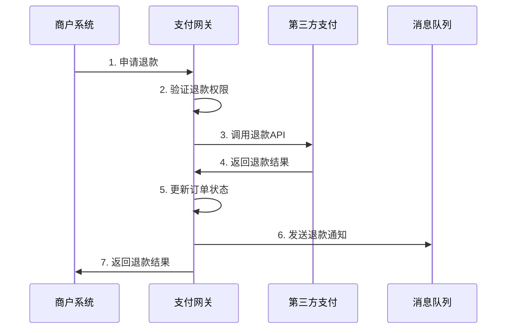
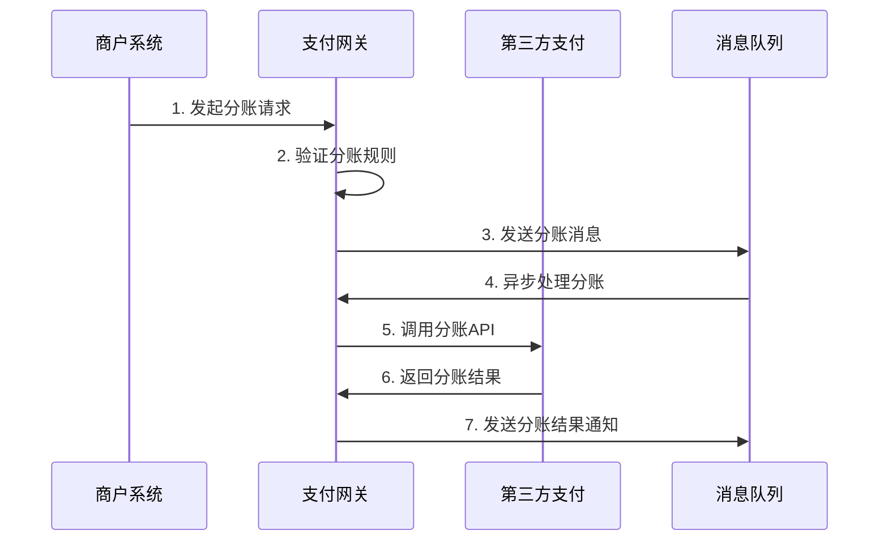

# Jeepay（计全支付）技术文档

## 1. 架构设计

### 1.1 系统概述

Jeepay是一套开源的支付系统，支持多渠道服务商和普通商户模式。系统采用微服务架构，基于Spring Boot 3.3.7开发，使用Ant Design Vue作为前端框架。

### 1.2 整体架构

```
┌─────────────────┐    ┌─────────────────┐    ┌─────────────────┐
│   商户系统      │    │   运营平台      │    │   支付网关      │
│  (Merchant)     │    │  (Manager)      │    │  (Payment)      │
│   Port: 9218    │    │   Port: 9217    │    │   Port: 9216    │
└─────────────────┘    └─────────────────┘    └─────────────────┘
         │                       │                       │
         └───────────────────────┼───────────────────────┘
                                 │
                    ┌─────────────────┐
                    │   业务服务层    │
                    │  (Service)      │
                    └─────────────────┘
                                 │
        ┌────────────────────────┼────────────────────────┐
        │                        │                        │
┌─────────────────┐    ┌─────────────────┐    ┌─────────────────┐
│   核心组件      │    │   消息队列      │    │   对象存储      │
│   (Core)        │    │   (MQ)          │    │   (OSS)         │
└─────────────────┘    └─────────────────┘    └─────────────────┘
```

### 1.3 技术栈

| 组件 | 技术 | 版本 |
|------|------|------|
| 运行环境 | JDK | 17 |
| 开发框架 | Spring Boot | 3.3.7 |
| 权限管理 | Spring Security | - |
| 数据库 | MySQL | 5.7.x/8.0+ |
| 缓存 | Redis | 3.2.8+ |
| 消息队列 | ActiveMQ/RabbitMQ/RocketMQ | - |
| ORM框架 | MyBatis-Plus | 3.4.2 |
| 前端框架 | Ant Design Vue | 4.2.6 |
| 微信SDK | WxJava | 4.6.0 |
| 工具库 | Hutool | 5.8.26 |

### 1.4 模块职责

#### 1.4.1 核心服务模块

**jeepay-payment（支付网关）**
- 端口：9216
- 职责：
  - 接收商户支付请求
  - 调用第三方支付渠道API
  - 处理支付回调通知
  - 订单状态管理
  - 支付结果查询

**jeepay-manager（运营平台）**
- 端口：9217
- 职责：
  - 系统管理员操作界面
  - 支付渠道配置管理
  - 商户审核和管理
  - 应用密钥管理
  - 系统监控和统计

**jeepay-merchant（商户系统）**
- 端口：9218
- 职责：
  - 商户操作界面
  - 订单管理和查询
  - 退款申请和处理
  - 结算和对账
  - 应用管理

**jeepay-service（业务服务层）**
- 职责：
  - 共享业务逻辑处理
  - 数据访问层封装
  - 业务规则实现
  - 被其他服务模块调用

#### 1.4.2 公共组件

**jeepay-components-mq（消息队列组件）**
- 支持多种MQ实现：ActiveMQ、RabbitMQ、RocketMQ、阿里云RocketMQ
- 核心消息类型：
  - `PayOrderMchNotifyMQ`: 支付订单商户通知
  - `PayOrderDivisionMQ`: 支付订单分账处理
  - `PayOrderReissueMQ`: 支付订单补单处理
  - `CleanMchLoginAuthCacheMQ`: 清理商户登录缓存
  - `ResetAppConfigMQ`: 重置应用配置
  - `ResetIsvMchAppInfoConfigMQ`: 重置服务商商户应用信息

**jeepay-components-oss（对象存储组件）**
- 支持多种云存储：阿里云OSS等
- 功能：文件上传、下载、删除、访问控制

## 2. 业务流程

### 2.1 支付流程



#### 2.1.1 详细步骤

1. **创建支付订单**
   - 商户系统调用支付网关创建订单API
   - 支付网关验证商户身份和参数
   - 生成唯一订单号，保存订单信息

2. **调用支付渠道**
   - 根据商户配置的支付渠道参数
   - 构造对应渠道的支付请求
   - 调用第三方支付API

3. **返回支付信息**
   - 获取支付跳转URL或支付参数
   - 返回给商户系统供用户支付使用

4. **用户支付**
   - 用户在第三方支付页面完成支付
   - 第三方支付处理支付请求

5. **异步回调**
   - 第三方支付异步通知支付结果
   - 支付网关验证回调数据签名
   - 处理重复通知和异常情况

6. **订单状态更新**
   - 更新订单状态和支付信息
   - 记录支付流水和手续费

7. **商户通知**
   - 通过MQ异步通知商户系统
   - 支持重试机制和通知确认

### 2.2 退款流程



### 2.3 分账流程



## 3. API说明

### 3.1 API基础信息

- **基础URL**: `http(s)://{domain}:{port}/api`
- **数据格式**: JSON
- **字符编码**: UTF-8
- **签名算法**: MD5/HMAC-SHA256
- **认证方式**: AppID + AppSecret + 数字签名

### 3.2 通用响应格式

```json
{
  "code": 0,                    // 状态码：0成功，非0失败
  "msg": "success",             // 响应消息
  "data": {}                    // 响应数据
}
```

### 3.3 状态码说明

| 状态码 | 说明 |
|--------|------|
| 0 | 成功 |
| 1 | 参数错误 |
| 2 | 签名错误 |
| 3 | 权限不足 |
| 4 | 订单不存在 |
| 5 | 订单状态异常 |
| 6 | 余额不足 |
| 7 | 渠道异常 |
| 500 | 系统内部错误 |

### 3.4 支付相关API

#### 3.4.1 创建支付订单

**请求URL**: `/api/pay/order/create`
**请求方法**: POST
**Content-Type**: application/json

**请求参数**:
```json
{
  "mchNo": "M00000001",              // 商户号
  "appId": "APP_00000001",           // 应用ID
  "mchOrderNo": "ORDER20231201001",  // 商户订单号
  "amount": 100,                      // 订单金额（分）
  "currency": "CNY",                 // 币种
  "clientIp": "127.0.0.1",           // 客户端IP
  "device": "WEB",                   // 设备类型
  "subject": "商品购买",              // 订单标题
  "body": "购买商品描述",              // 订单描述
  "notifyUrl": "https://merchant.com/notify",  // 异步通知URL
  "returnUrl": "https://merchant.com/return",  // 同步跳转URL
  "channel": "ALIPAY_PC_DIRECT",      // 支付渠道
  "extra": {                          // 渠道扩展参数
    "qrType": "NATIVE"
  }
}
```

**响应参数**:
```json
{
  "code": 0,
  "msg": "success",
  "data": {
    "payOrderId": "P000000000000001",     // 支付订单ID
    "orderState": 0,                        // 订单状态：0-待支付
    "payAmount": 100,                       // 支付金额
    "payData": "https://pay.alipay.com/xxx", // 支付参数/URL
    "expireTime": 1701398400000             // 过期时间
  }
}
```

#### 3.4.2 查询支付订单

**请求URL**: `/api/pay/order/query`
**请求方法**: POST

**请求参数**:
```json
{
  "mchNo": "M00000001",
  "appId": "APP_00000001",
  "mchOrderNo": "ORDER20231201001"
}
```

**响应参数**:
```json
{
  "code": 0,
  "msg": "success",
  "data": {
    "payOrderId": "P000000000000001",
    "mchOrderNo": "ORDER20231201001",
    "channelOrderNo": "202312011234567890",
    "orderState": 2,                    // 订单状态
    "payAmount": 100,
    "paidAmount": 100,
    "refundAmount": 0,
    "paySuccTime": 1701398400000
  }
}
```

#### 3.4.3 申请退款

**请求URL**: `/api/pay/refund/apply`
**请求方法**: POST

**请求参数**:
```json
{
  "mchNo": "M00000001",
  "appId": "APP_00000001",
  "mchRefundNo": "REFUND20231201001",
  "payOrderId": "P000000000000001",
  "refundAmount": 100,
  "refundReason": "用户申请退款"
}
```

### 3.5 回调通知

#### 3.5.1 支付结果通知

**通知URL**: 商户创建订单时指定的notifyUrl
**请求方法**: POST
**Content-Type**: application/json

**通知参数**:
```json
{
  "sign": "abc123def456",              // 签名
  "signType": "MD5",                   // 签名类型
  "mchNo": "M00000001",
  "appId": "APP_00000001",
  "mchOrderNo": "ORDER20231201001",
  "payOrderId": "P000000000000001",
  "channelOrderNo": "202312011234567890",
  "orderState": 2,                     // 订单状态
  "payAmount": 100,
  "paidAmount": 100,
  "paySuccTime": 1701398400000
}
```

**响应格式**:
```json
{"code":0,"msg":"success"}
```

### 3.6 SDK使用

#### 3.6.1 Java SDK

```java
// 初始化客户端
JeepayClient client = new JeepayClient.Builder()
    .appId("APP_00000001")
    .appSecret("your_app_secret")
    .gatewayUrl("https://api.jeepay.com")
    .build();

// 创建支付订单
CreatePayOrderRequest request = new CreatePayOrderRequest();
request.setMchOrderNo("ORDER20231201001");
request.setAmount(100L);
request.setCurrency("CNY");
request.setSubject("商品购买");
request.setChannel("ALIPAY_PC_DIRECT");

JeepayResponse response = client.execute(request);
```

#### 3.6.2 Python SDK

```python
from jeepay import JeepayClient

# 初始化客户端
client = JeepayClient(
    app_id="APP_00000001",
    app_secret="your_app_secret",
    gateway_url="https://api.jeepay.com"
)

# 创建支付订单
response = client.create_pay_order({
    "mchOrderNo": "ORDER20231201001",
    "amount": 100,
    "currency": "CNY",
    "subject": "商品购买",
    "channel": "ALIPAY_PC_DIRECT"
})
```

## 4. 部署配置

### 4.1 环境要求

- JDK 17+
- MySQL 5.7+/8.0+
- Redis 3.2.8+
- Maven 3.6+
- Docker（可选）

### 4.2 数据库配置

```yaml
# application.yml
spring:
  datasource:
    url: jdbc:mysql://localhost:3306/jeepay?useUnicode=true&characterEncoding=utf8
    username: root
    password: root
    driver-class-name: com.mysql.cj.jdbc.Driver

  redis:
    host: localhost
    port: 6379
    password:
    database: 0
```

### 4.3 消息队列配置

```yaml
# ActiveMQ配置示例
jeepay:
  mq:
    activemq:
      broker-url: tcp://localhost:61616
      username: admin
      password: admin
```

## 5. 安全机制

### 5.1 身份认证
- AppID + AppSecret 双重认证
- JWT Token 会话管理
- Spring Security 权限控制

### 5.2 数据加密
- 传输层：HTTPS/TLS 1.2+
- 敏感数据：AES-256 加密
- 签名验证：MD5/HMAC-SHA256

### 5.3 防重放攻击
- 请求时间戳校验
- 随机数(nonce)防重放
- 订单状态幂等性控制

## 6. 运维监控

### 6.1 日志配置
- Logback 日志框架
- 分级日志：DEBUG/INFO/WARN/ERROR
- 日志文件按天滚动

### 6.2 监控指标
- 订单成功率
- 支付响应时间
- 系统吞吐量
- 错误率统计

### 6.3 告警机制
- 订单异常告警
- 系统资源告警
- 接口超时告警

---

**文档版本**: v1.0
**更新时间**: 2026-03-26
**维护团队**: 计全科技